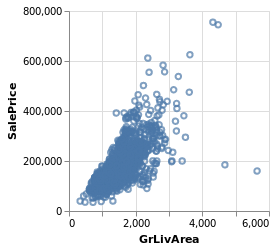
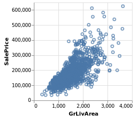
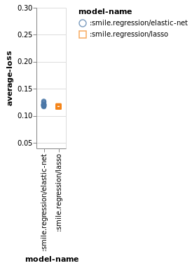
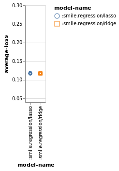

# Getting Started

This is a tutorial for a a couple of new Clojure libraries for Machine Learning and ETL -- part of the tech.ml stack.

Author: Chris Nuernberger


Translated to [Nextjournal](https://nextjournal.com/alan/tech-dataset-getting-started): Alan Marazzi

The API is still alpha, we are putting our efforts into extending and beautifying it. Comments will be welcome!"

Reading from an excellent article on [advanced regression techniques](https://www.kaggle.com/juliencs/a-study-on-regression-applied-to-the-ames-dataset).  

The target is to predict the SalePrice column.


```clojure
(require '[clojupyter.misc.helper :as helper])
(helper/add-dependencies '[metasoarous/oz "1.5.2"])
(helper/add-dependencies '[techascent/tech.ml "0.19"])
(require '[oz.notebook.clojupyter :as oz])

(require '[tech.ml.dataset.etl :as etl])
(require '[tech.ml.dataset.etl.pipeline-operators :as pipe-ops])
(require '[tech.ml.dataset.etl.math-ops :as pipe-math])
(require '[tech.ml.dataset.etl.column-filters :as col-filters])
(require '[tech.ml.dataset :as dataset])
(require '[tech.ml.dataset.column :as ds-col])
(require '[tech.ml :as ml])
(require '[tech.ml.loss :as loss])
(require '[tech.ml.utils :as ml-utils])
(require '[clojure.core.matrix :as m])

;;use tablesaw as dataset backing store
(require '[tech.libs.tablesaw :as tablesaw])

;;model generators
(require '[tech.libs.smile.regression])

;;put/get nippy
(require '[tech.io :as io])
(require '[clojure.pprint :as pp])
(require '[clojure.set :as c-set])

(import '[java.io File])


(defn pp-str
  [ds]
  (with-out-str
    (pp/pprint ds)))


(defn print-table
  ([ks data]
     (->> data
          (map (fn [item-map]
                 (->> item-map
                      (map (fn [[k v]]
                             [k (if (or (float? v)
                                        (double? v))
                                  (format "%.3f" v)
                                  v)]))
                      (into {}))))
          (pp/print-table ks)))
  ([data]
   (print-table (sort (keys (first data))) data)))

(defn print-dataset 
    ([dataset column-names index-range]
     (print-table column-names (-> (dataset/select dataset column-names index-range)
                                   (dataset/->flyweight))))
    ([dataset column-names]
     (print-dataset dataset column-names :all)))

(defn gridsearch-model
  [dataset-name dataset loss-fn opts]
  (let [gs-options (ml/auto-gridsearch-options
                    (assoc opts
                           :gridsearch-depth 75
                           :top-n 20))]
    (println (format "Dataset: %s, Model %s"
                     dataset-name
                     (:model-type opts)))
    (let [gs-start (System/nanoTime)
          {results :retval
           milliseconds :milliseconds}
          (ml-utils/time-section
           (ml/gridsearch
            (assoc gs-options :k-fold 10)
            loss-fn
            dataset))]
      (->> results
           (mapv #(merge %
                         {:gridsearch-time-ms milliseconds
                          :dataset-name dataset-name}))))))


(defn gridsearch-dataset
  [dataset-name force-gridsearch? dataset options]
  (let [ds-filename (format "file://ames-%s-results.nippy" dataset-name)]
    (if (or force-gridsearch?
            (not (.exists ^File (io/file ds-filename))))
      (let [base-systems [{:model-type :smile.regression/lasso}
                          {:model-type :smile.regression/ridge}
                          {:model-type :smile.regression/elastic-net}]
            results (->> base-systems
                         (map #(merge options %))
                         (mapcat
                          (partial gridsearch-model
                                   dataset-name
                                   dataset
                                   loss/rmse))
                         vec)]
        (io/put-nippy! ds-filename results)
        results)
      (io/get-nippy ds-filename))))


(defn results->accuracy-dataset
  [gridsearch-results]
  (->> gridsearch-results
       (map (fn [{:keys [average-loss options predict-time train-time]}]
              {:average-loss average-loss
               :model-name (str (:model-type options))
               :predict-time predict-time
               :train-time train-time}))))


(defn render-results
  [title gridsearch-results]
  [:div
   [:h3 title]
   [:vega-lite {:data {:values (results->accuracy-dataset gridsearch-results)}
                :mark :point
                :transform [{:filter {:field :average-loss :range [0.05, 0.3]}}]
                :encoding {:y {:field :average-loss
                               :type :quantitative
                               :scale {:domain [0.05 0.3]}}
                           :x {:field :model-name
                               :type :nominal}
                           :color {:field :model-name
                                   :type :nominal}
                           :shape {:field :model-name
                                   :type :nominal}}}]])
```


    #'user/render-results


Well, that wasn't particularly pleasant but it at least is something you can cut & paste...


```clojure
(def src-dataset (tablesaw/path->tablesaw-dataset "data/ames-house-prices/train.csv"))

(println (m/shape src-dataset))
```

    [81 1460]


The shape is backward as compared to pandas.  This is by intention; core.matrix is a row-major linear algebra system.  tech.ml.dataset is column-major.  Thus, to ensure sanity when doing conversions we represent the data in a normal shape.  Note that pandas returns [1460 81].

## Outliers

We first check for outliers, graph and then remove them.


```clojure
(-> [:vega-lite {:data {:values
                                (-> src-dataset
                                (dataset/select ["SalePrice" "GrLivArea"] :all)
                                (dataset/->flyweight))}
                     :mark :point
                     :encoding {:y {:field "SalePrice"
                                    :type :quantitative}
                                :x {:field "GrLivArea"
                                    :type :quantitative}}}]
    oz/view!)
```




```clojure
(def filtered-ds (pipe-ops/filter src-dataset "GrLivArea" '(< (col) 4000)))
```
#'user/filtered-ds


```clojure
(-> [:vega-lite {:data {:values
                                (-> filtered-ds
                                (dataset/select ["SalePrice" "GrLivArea"] :all)
                                (dataset/->flyweight))}
                     :mark :point
                     :encoding {:y {:field "SalePrice"
                                    :type :quantitative}
                                :x {:field "GrLivArea"
                                    :type :quantitative}}}]
    oz/view!)
```





## Initial Pipeline

We now begin to construct our data processing pipeline.  Note that all pipeline operations are available as repl functions from the pip-ops namespace.  Since we have the pipeline outline we want from the article, I will just represent the pipeline mainly as pure data.


```clojure
(def initial-pipeline-from-article
  '[[remove "Id"]
    [m= "SalePrice" (log1p (col))]])
```


    #'user/initial-pipeline-from-article


## Categorical Fixes

Whether columns are categorical or not is defined by attributes.


```clojure
(def more-categorical
  '[[set-attribute ["MSSubClass" "OverallQual" "OverallCond"] :categorical? true]])

(println "pre-categorical-count" (count (col-filters/categorical? filtered-ds)))

(def post-categorical-fix (-> (etl/apply-pipeline filtered-ds
                                                  (concat initial-pipeline-from-article
                                                          more-categorical)
                                                  {})
                              :dataset))

(println "post-categorical-count" (count (col-filters/categorical? post-categorical-fix)))

```

    pre-categorical-count 42
    post-categorical-count 45


## Missing Entries

Missing data is a theme that will come up again and again.  Pandas has great tooling to clean up missing entries and we borrow heavily from them.


```clojure
;; Impressive patience to come up with this list!!
(def initial-missing-entries
  '[
    ;; Handle missing values for features where median/mean or most common value doesn't
    ;; make sense

    ;; Alley : data description says NA means "no alley access"
    [replace-missing "Alley" "None"]
    ;; BedroomAbvGr : NA most likely means 0
    [replace-missing ["BedroomAbvGr"
                      "BsmtFullBath"
                      "BsmtHalfBath"
                      "BsmtUnfSF"
                      "EnclosedPorch"
                      "Fireplaces"
                      "GarageArea"
                      "GarageCars"
                      "HalfBath"
                      ;; KitchenAbvGr : NA most likely means 0
                      "KitchenAbvGr"
                      "LotFrontage"
                      "MasVnrArea"
                      "MiscVal"
                      ;; OpenPorchSF : NA most likely means no open porch
                      "OpenPorchSF"
                      "PoolArea"
                      ;; ScreenPorch : NA most likely means no screen porch
                      "ScreenPorch"
                      ;; TotRmsAbvGrd : NA most likely means 0
                      "TotRmsAbvGrd"
                      ;; WoodDeckSF : NA most likely means no wood deck
                      "WoodDeckSF"
                      ]
     0]
    ;; BsmtQual etc : data description says NA for basement features is "no basement"
    [replace-missing ["BsmtQual"
                      "BsmtCond"
                      "BsmtExposure"
                      "BsmtFinType1"
                      "BsmtFinType2"
                      ;; Fence : data description says NA means "no fence"
                      "Fence"
                      ;; FireplaceQu : data description says NA means "no fireplace"
                      "FireplaceQu"
                      ;; GarageType etc : data description says NA for garage features
                      ;; is "no garage"
                      "GarageType"
                      "GarageFinish"
                      "GarageQual"
                      "GarageCond"
                      ;; MiscFeature : data description says NA means "no misc feature"
                      "MiscFeature"
                      ;; PoolQC : data description says NA means "no pool"
                      "PoolQC"
                      ]
     "No"]
    [replace-missing "CentralAir" "N"]
    [replace-missing ["Condition1"
                      "Condition2"]
     "Norm"]
    ;; Condition : NA most likely means Normal
    ;; EnclosedPorch : NA most likely means no enclosed porch
    ;; External stuff : NA most likely means average
    [replace-missing ["ExterCond"
                      "ExterQual"
                      ;; HeatingQC : NA most likely means typical
                      "HeatingQC"
                      ;; KitchenQual : NA most likely means typical
                      "KitchenQual"
                      ]
     "TA"]
    ;; Functional : data description says NA means typical
    [replace-missing "Functional" "Typ"]
    ;; LotShape : NA most likely means regular
    [replace-missing "LotShape" "Reg"]
    ;; MasVnrType : NA most likely means no veneer
    [replace-missing "MasVnrType" "None"]
    ;; PavedDrive : NA most likely means not paved
    [replace-missing "PavedDrive" "N"]
    [replace-missing "SaleCondition" "Normal"]
    [replace-missing "Utilities" "AllPub"]])

(println "pre missing fix #1")
(pp/pprint (dataset/columns-with-missing-seq post-categorical-fix))

(def post-missing (-> (etl/apply-pipeline post-categorical-fix initial-missing-entries {})
                              :dataset))

(println "post missing fix #1")

(pp/pprint (dataset/columns-with-missing-seq post-missing))
```

    pre missing fix #1
    ({:column-name "LotFrontage", :missing-count 259}
     {:column-name "Alley", :missing-count 1365}
     {:column-name "MasVnrType", :missing-count 8}
     {:column-name "MasVnrArea", :missing-count 8}
     {:column-name "BsmtQual", :missing-count 37}
     {:column-name "BsmtCond", :missing-count 37}
     {:column-name "BsmtExposure", :missing-count 38}
     {:column-name "BsmtFinType1", :missing-count 37}
     {:column-name "BsmtFinType2", :missing-count 38}
     {:column-name "Electrical", :missing-count 1}
     {:column-name "FireplaceQu", :missing-count 690}
     {:column-name "GarageType", :missing-count 81}
     {:column-name "GarageYrBlt", :missing-count 81}
     {:column-name "GarageFinish", :missing-count 81}
     {:column-name "GarageQual", :missing-count 81}
     {:column-name "GarageCond", :missing-count 81}
     {:column-name "PoolQC", :missing-count 1451}
     {:column-name "Fence", :missing-count 1176}
     {:column-name "MiscFeature", :missing-count 1402})
    post missing fix #1
    ({:column-name "Electrical", :missing-count 1}
     {:column-name "GarageYrBlt", :missing-count 81})


## String->Number
We need to convert string data into numbers somehow.  One method is to build a lookup table such that 1 string column gets converted into 1 numeric column.  The exact encoding of these strings can be very important to communicate semantic information from the dataset to the ml system.  We remember all these mappings because we have to use them later.  They get stored both in the recorded pipeline and in the options map so we can reverse-map label values back into their categorical initial values.


```clojure
(def str->number-initial-map
  {
   "Alley"  {"Grvl"  1 "Pave" 2 "None" 0}
   "BsmtCond"  {"No"  0 "Po"  1 "Fa"  2 "TA"  3 "Gd"  4 "Ex"  5}
   "BsmtExposure"  {"No"  0 "Mn"  1 "Av" 2 "Gd"  3}
   "BsmtFinType1"  {"No"  0 "Unf"  1 "LwQ" 2 "Rec"  3 "BLQ"  4
                     "ALQ"  5 "GLQ"  6}
   "BsmtFinType2"  {"No"  0 "Unf"  1 "LwQ" 2 "Rec"  3 "BLQ"  4
                     "ALQ"  5 "GLQ"  6}
   "BsmtQual"  {"No"  0 "Po"  1 "Fa"  2 "TA" 3 "Gd"  4 "Ex"  5}
   "ExterCond"  {"Po"  1 "Fa"  2 "TA" 3 "Gd" 4 "Ex"  5}
   "ExterQual"  {"Po"  1 "Fa"  2 "TA" 3 "Gd" 4 "Ex"  5}
   "FireplaceQu"  {"No"  0 "Po"  1 "Fa"  2 "TA"  3 "Gd"  4 "Ex"  5}
   "Functional"  {"Sal"  1 "Sev"  2 "Maj2"  3 "Maj1"  4 "Mod" 5
                   "Min2"  6 "Min1"  7 "Typ"  8}
   "GarageCond"  {"No"  0 "Po"  1 "Fa"  2 "TA"  3 "Gd"  4 "Ex"  5}
   "GarageQual"  {"No"  0 "Po"  1 "Fa"  2 "TA"  3 "Gd"  4 "Ex"  5}
   "HeatingQC"  {"Po"  1 "Fa"  2 "TA"  3 "Gd"  4 "Ex"  5}
   "KitchenQual"  {"Po"  1 "Fa"  2 "TA"  3 "Gd"  4 "Ex"  5}
   "LandSlope"  {"Sev"  1 "Mod"  2 "Gtl"  3}
   "LotShape"  {"IR3"  1 "IR2"  2 "IR1"  3 "Reg"  4}
   "PavedDrive"  {"N"  0 "P"  1 "Y"  2}
   "PoolQC"  {"No"  0 "Fa"  1 "TA"  2 "Gd"  3 "Ex"  4}
   "Street"  {"Grvl"  1 "Pave"  2}
   "Utilities"  {"ELO"  1 "NoSeWa"  2 "NoSewr"  3 "AllPub"  4}
   })


(def str->number-pipeline
  (->> str->number-initial-map
       (map (fn [[k v-map]]
              ['string->number k v-map]))))

(def str-num-result (etl/apply-pipeline post-missing str->number-pipeline {}))
(def str-num-dataset (:dataset str-num-result))
(def str-num-ops (:options str-num-result))

(pp/pprint (:label-map str-num-ops))
```

    {"PoolQC" {"No" 0, "Fa" 1, "TA" 2, "Gd" 3, "Ex" 4},
     "BsmtCond" {"No" 0, "Po" 1, "Fa" 2, "TA" 3, "Gd" 4, "Ex" 5},
     "GarageQual" {"No" 0, "Po" 1, "Fa" 2, "TA" 3, "Gd" 4, "Ex" 5},
     "Alley" {"Grvl" 1, "Pave" 2, "None" 0},
     "LandSlope" {"Sev" 1, "Mod" 2, "Gtl" 3},
     "PavedDrive" {"N" 0, "P" 1, "Y" 2},
     "BsmtFinType2"
     {"No" 0, "Unf" 1, "LwQ" 2, "Rec" 3, "BLQ" 4, "ALQ" 5, "GLQ" 6},
     "Street" {"Grvl" 1, "Pave" 2},
     "ExterQual" {"Po" 1, "Fa" 2, "TA" 3, "Gd" 4, "Ex" 5},
     "BsmtFinType1"
     {"No" 0, "Unf" 1, "LwQ" 2, "Rec" 3, "BLQ" 4, "ALQ" 5, "GLQ" 6},
     "FireplaceQu" {"No" 0, "Po" 1, "Fa" 2, "TA" 3, "Gd" 4, "Ex" 5},
     "LotShape" {"IR3" 1, "IR2" 2, "IR1" 3, "Reg" 4},
     "HeatingQC" {"Po" 1, "Fa" 2, "TA" 3, "Gd" 4, "Ex" 5},
     "KitchenQual" {"Po" 1, "Fa" 2, "TA" 3, "Gd" 4, "Ex" 5},
     "GarageCond" {"No" 0, "Po" 1, "Fa" 2, "TA" 3, "Gd" 4, "Ex" 5},
     "BsmtQual" {"No" 0, "Po" 1, "Fa" 2, "TA" 3, "Gd" 4, "Ex" 5},
     "ExterCond" {"Po" 1, "Fa" 2, "TA" 3, "Gd" 4, "Ex" 5},
     "Utilities" {"ELO" 1, "NoSeWa" 2, "NoSewr" 3, "AllPub" 4},
     "BsmtExposure" {"No" 0, "Mn" 1, "Av" 2, "Gd" 3},
     "Functional"
     {"Sal" 1,
      "Sev" 2,
      "Maj2" 3,
      "Maj1" 4,
      "Mod" 5,
      "Min2" 6,
      "Min1" 7,
      "Typ" 8}}


## Replacing values

There is a numeric operator that allows you to map values from one value to another in a column.  We now use this to provide simplified versions of some of the columns.


```clojure
(def replace-maps
  {
   ;; Create new features
   ;; 1* Simplifications of existing features
   "SimplOverallQual" {"OverallQual" {1  1, 2  1, 3  1, ;; bad
                                     4  2, 5  2, 6  2, ;; average
                                     7  3, 8  3, 9  3, 10  3 ;; good
                                      }}
   "SimplOverallCond" {"OverallCond" {1  1, 2  1, 3  1,       ;; bad
                                      4  2, 5  2, 6  2,       ;; average
                                      7  3, 8  3, 9  3, 10  3 ;; good
                                      }}
   "SimplPoolQC" {"PoolQC" {1  1, 2  1,    ;; average
                            3  2, 4  2     ;; good
                            }}
   "SimplGarageCond" {"GarageCond" {1  1,             ;; bad
                                    2  1, 3  1,       ;; average
                                    4  2, 5  2        ;; good
                                    }}
   "SimplGarageQual" {"GarageQual" {1  1,             ;; bad
                                    2  1, 3  1,       ;; average
                                    4  2, 5  2        ;; good
                                    }}
   "SimplFireplaceQu"  {"FireplaceQu" {1  1,           ;; bad
                                        2  1, 3  1,     ;; average
                                        4  2, 5  2      ;; good
                                        }}
   "SimplFunctional"  {"Functional" {1  1, 2  1,           ;; bad
                                      3  2, 4  2,           ;; major
                                      5  3, 6  3, 7  3,     ;; minor
                                      8  4                  ;; typical
                                      }}
   "SimplKitchenQual" {"KitchenQual" {1  1,             ;; bad
                                      2  1, 3  1,       ;; average
                                      4  2, 5  2        ;; good
                                      }}
   "SimplHeatingQC"  {"HeatingQC" {1  1,           ;; bad
                                   2  1, 3  1,     ;; average
                                   4  2, 5  2      ;; good
                                    }}
   "SimplBsmtFinType1"  {"BsmtFinType1" {1  1,         ;; unfinished
                                         2  1, 3  1,   ;; rec room
                                         4  2, 5  2, 6  2 ;; living quarters
                                          }}
   "SimplBsmtFinType2" {"BsmtFinType2" {1 1,           ;; unfinished
                                        2 1, 3 1,      ;; rec room
                                        4 2, 5 2, 6 2  ;; living quarters
                                        }}
   "SimplBsmtCond" {"BsmtCond" {1 1,    ;; bad
                                2 1, 3 1, ;; average
                                4 2, 5 2  ;; good
                                }}
   "SimplBsmtQual" {"BsmtQual" {1 1,      ;; bad
                                2 1, 3 1, ;; average
                                4 2, 5 2  ;; good
                                }}
   "SimplExterCond" {"ExterCond" {1 1,      ;; bad
                                  2 1, 3 1, ;; average
                                  4 2, 5 2  ;; good
                                  }}
   "SimplExterQual" {"ExterQual" {1 1,      ;; bad
                                  2 1, 3 1, ;; average
                                  4 2, 5 2  ;; good
                                  }}
   })


(def simplifications
  (->> replace-maps
       (mapv (fn [[k v-map]]
               (let [[src-name replace-data] (first v-map)]
                 ['m= k ['replace ['col src-name] replace-data]])))))

(pp/pprint (take 3 simplifications))

(def replace-dataset (-> (etl/apply-pipeline str-num-dataset simplifications {})
                         :dataset))

(pp/pprint (-> (dataset/column str-num-dataset "KitchenQual")
                (ds-col/unique)))

(pp/pprint (-> (dataset/column replace-dataset "SimplKitchenQual")
                (ds-col/unique)))
```

    ([m=
      "SimplKitchenQual"
      [replace [col "KitchenQual"] {1 1, 2 1, 3 1, 4 2, 5 2}]]
     [m=
      "SimplBsmtFinType2"
      [replace [col "BsmtFinType2"] {1 1, 2 1, 3 1, 4 2, 5 2, 6 2}]]
     [m=
      "SimplExterQual"
      [replace [col "ExterQual"] {1 1, 2 1, 3 1, 4 2, 5 2}]])
    #{2.0 4.0 5.0 3.0}
    #{2.0 1.0}


## Linear Combinations

We create a set of simple linear combinations that derive from our semantic understanding of the dataset.


```clojure
(def linear-combinations
  ;; 2* Combinations of existing features
  ;; Overall quality of the house
  '[
    [m= "OverallGrade" (* (col "OverallQual") (col "OverallCond"))]
    ;; Overall quality of the garage
    [m= "GarageGrade" (* (col "GarageQual") (col "GarageCond"))]
    ;; Overall quality of the exterior
    [m= "ExterGrade"(* (col "ExterQual") (col "ExterCond"))]
    ;; Overall kitchen score
    [m= "KitchenScore" (* (col "KitchenAbvGr") (col "KitchenQual"))]
    ;; Overall fireplace score
    [m= "FireplaceScore" (* (col "Fireplaces") (col "FireplaceQu"))]
    ;; Overall garage score
    [m= "GarageScore" (* (col "GarageArea") (col "GarageQual"))]
    ;; Overall pool score
    [m= "PoolScore" (* (col "PoolArea") (col "PoolQC"))]
    ;; Simplified overall quality of the house
    [m= "SimplOverallGrade" (* (col "SimplOverallQual") (col "SimplOverallCond"))]
    ;; Simplified overall quality of the exterior
    [m= "SimplExterGrade" (* (col "SimplExterQual") (col "SimplExterCond"))]
    ;; Simplified overall pool score
    [m= "SimplPoolScore" (* (col "PoolArea") (col "SimplPoolQC"))]
    ;; Simplified overall garage score
    [m= "SimplGarageScore" (* (col "GarageArea") (col "SimplGarageQual"))]
    ;; Simplified overall fireplace score
    [m= "SimplFireplaceScore" (* (col "Fireplaces") (col "SimplFireplaceQu"))]
    ;; Simplified overall kitchen score
    [m= "SimplKitchenScore" (* (col "KitchenAbvGr" ) (col "SimplKitchenQual"))]
    ;; Total number of bathrooms
    [m= "TotalBath" (+ (col "BsmtFullBath") (* 0.5 (col "BsmtHalfBath"))
                       (col "FullBath") (* 0.5 (col "HalfBath")))]
    ;; Total SF for house (incl. basement)
    [m= "AllSF"  (+ (col "GrLivArea") (col "TotalBsmtSF"))]
    ;; Total SF for 1st + 2nd floors
    [m= "AllFlrsSF" (+ (col "1stFlrSF") (col "2ndFlrSF"))]
    ;; Total SF for porch
    [m= "AllPorchSF" (+ (col "OpenPorchSF") (col "EnclosedPorch")
                        (col "3SsnPorch") (col "ScreenPorch"))]
    ;; Encode MasVrnType
    [string->number "MasVnrType" ["None" "BrkCmn" "BrkFace" "CBlock" "Stone"]]
    [m= "HasMasVnr" (not-eq (col "MasVnrType") 0)]
    ]
  )

(def linear-combined-ds (-> (etl/apply-pipeline replace-dataset linear-combinations {})
                            :dataset))


(let [print-columns ["TotalBath" "BsmtFullBath" "BsmtHalfBath" 
                                  "FullBath" "HalfBath"]]
  (println (print-table print-columns 
                        (-> linear-combined-ds
                            (dataset/select print-columns (range 10))
                            (dataset/->flyweight)))))

(let [print-columns ["AllSF" "GrLivArea" "TotalBsmtSF"]]
  (println (print-table print-columns 
                        (-> linear-combined-ds
                            (dataset/select print-columns (range 10))
                            (dataset/->flyweight)))))
```

    
    | TotalBath | BsmtFullBath | BsmtHalfBath | FullBath | HalfBath |
    |-----------+--------------+--------------+----------+----------|
    |     3.500 |        1.000 |        0.000 |    2.000 |    1.000 |
    |     2.500 |        0.000 |        1.000 |    2.000 |    0.000 |
    |     3.500 |        1.000 |        0.000 |    2.000 |    1.000 |
    |     2.000 |        1.000 |        0.000 |    1.000 |    0.000 |
    |     3.500 |        1.000 |        0.000 |    2.000 |    1.000 |
    |     2.500 |        1.000 |        0.000 |    1.000 |    1.000 |
    |     3.000 |        1.000 |        0.000 |    2.000 |    0.000 |
    |     3.500 |        1.000 |        0.000 |    2.000 |    1.000 |
    |     2.000 |        0.000 |        0.000 |    2.000 |    0.000 |
    |     2.000 |        1.000 |        0.000 |    1.000 |    0.000 |
    nil
    
    |    AllSF | GrLivArea | TotalBsmtSF |
    |----------+-----------+-------------|
    | 2566.000 |  1710.000 |     856.000 |
    | 2524.000 |  1262.000 |    1262.000 |
    | 2706.000 |  1786.000 |     920.000 |
    | 2473.000 |  1717.000 |     756.000 |
    | 3343.000 |  2198.000 |    1145.000 |
    | 2158.000 |  1362.000 |     796.000 |
    | 3380.000 |  1694.000 |    1686.000 |
    | 3197.000 |  2090.000 |    1107.000 |
    | 2726.000 |  1774.000 |     952.000 |
    | 2068.000 |  1077.000 |     991.000 |
    nil


## Correlation Table
Let's check the correlations between the various columns and the target column (SalePrice).  


```clojure
(def article-correlations
  ;;Default for pandas is pearson.
  ;;  Find most important features relative to target
  (->> {"SalePrice"            1.000
   "OverallQual"          0.819
   "AllSF"                0.817
   "AllFlrsSF"            0.729
   "GrLivArea"            0.719
   "SimplOverallQual"     0.708
   "ExterQual"            0.681
   "GarageCars"           0.680
   "TotalBath"            0.673
   "KitchenQual"          0.667
   "GarageScore"          0.657
   "GarageArea"           0.655
   "TotalBsmtSF"          0.642
   "SimplExterQual"       0.636
   "SimplGarageScore"     0.631
   "BsmtQual"             0.615
   "1stFlrSF"             0.614
   "SimplKitchenQual"     0.610
   "OverallGrade"         0.604
   "SimplBsmtQual"        0.594
   "FullBath"             0.591
   "YearBuilt"            0.589
   "ExterGrade"           0.587
   "YearRemodAdd"         0.569
   "FireplaceQu"          0.547
   "GarageYrBlt"          0.544
   "TotRmsAbvGrd"         0.533
   "SimplOverallGrade"    0.527
   "SimplKitchenScore"    0.523
   "FireplaceScore"       0.518
   "SimplBsmtCond"        0.204
   "BedroomAbvGr"         0.204
   "AllPorchSF"           0.199
   "LotFrontage"          0.174
   "SimplFunctional"      0.137
   "Functional"           0.136
   "ScreenPorch"          0.124
   "SimplBsmtFinType2"    0.105
   "Street"               0.058
   "3SsnPorch"            0.056
   "ExterCond"            0.051
   "PoolArea"             0.041
   "SimplPoolScore"       0.040
   "SimplPoolQC"          0.040
   "PoolScore"            0.040
   "PoolQC"               0.038
   "BsmtFinType2"         0.016
   "Utilities"            0.013
   "BsmtFinSF2"           0.006
   "BsmtHalfBath"        -0.015
   "MiscVal"             -0.020
   "SimplOverallCond"    -0.028
   "YrSold"              -0.034
   "OverallCond"         -0.037
   "LowQualFinSF"        -0.038
   "LandSlope"           -0.040
   "SimplExterCond"      -0.042
   "KitchenAbvGr"        -0.148
   "EnclosedPorch"       -0.149
   "LotShape"            -0.286
   }
       (sort-by second >)
  ))

(def tech-ml-correlations (get (dataset/correlation-table 
                                 linear-combined-ds 
                                 :pearson) 
                               "SalePrice"))

(pp/print-table (map #(zipmap [:pandas :tech.ml.dataset]
                                                  [%1 %2])
                                         (take 20 article-correlations)
                                         (take 20 tech-ml-correlations)))
```

    WARNING - excluding columns with missing values:
     [{:column-name Electrical, :missing-count 1} {:column-name GarageYrBlt, :missing-count 81}]
    WARNING - excluding non-numeric columns:
     [MSZoning LandContour LotConfig Neighborhood Condition1 Condition2 BldgType HouseStyle RoofStyle RoofMatl Exterior1st Exterior2nd Foundation Heating Electrical GarageType GarageFinish Fence MiscFeature SaleType SaleCondition]
    
    |                    :pandas |                        :tech.ml.dataset |
    |----------------------------+-----------------------------------------|
    |          ["SalePrice" 1.0] |                       ["SalePrice" 1.0] |
    |      ["OverallQual" 0.819] |       ["OverallQual" 0.819240311620789] |
    |            ["AllSF" 0.817] |            ["AllSF" 0.8172719096463545] |
    |        ["AllFlrsSF" 0.729] |        ["AllFlrsSF" 0.7294213272894039] |
    |        ["GrLivArea" 0.719] |        ["GrLivArea" 0.7188444008280218] |
    | ["SimplOverallQual" 0.708] |   ["SimplOverallQual" 0.70793366139543] |
    |        ["ExterQual" 0.681] |        ["ExterQual" 0.6809467113796699] |
    |        ["GarageCars" 0.68] |       ["GarageCars" 0.6804076538001473] |
    |        ["TotalBath" 0.673] |        ["TotalBath" 0.6729288592505422] |
    |      ["KitchenQual" 0.667] |      ["KitchenQual" 0.6671738265720056] |
    |      ["GarageScore" 0.657] |      ["GarageScore" 0.6568216258465022] |
    |       ["GarageArea" 0.655] |       ["GarageArea" 0.6552115300468117] |
    |      ["TotalBsmtSF" 0.642] |      ["TotalBsmtSF" 0.6415527990410921] |
    |   ["SimplExterQual" 0.636] |   ["SimplExterQual" 0.6355504445439201] |
    | ["SimplGarageScore" 0.631] | ["SimplGarageScore" 0.6308022446817723] |
    |         ["BsmtQual" 0.615] |         ["BsmtQual" 0.6152245192784745] |
    |         ["1stFlrSF" 0.614] |           ["1stFlrSF" 0.61374181150233] |
    |  ["SimplKitchenQual" 0.61] | ["SimplKitchenQual" 0.6101423001972696] |
    |     ["OverallGrade" 0.604] |     ["OverallGrade" 0.6042910598186415] |
    |    ["SimplBsmtQual" 0.594] |    ["SimplBsmtQual" 0.5936507179796586] |


## Polynomial Combinations

We now extend the power of our linear models to be effectively polynomial models for a subset of the columns.  We do this using the correlation table to indicate which columns are worth it (the author used the top 10).


```clojure
(defn polynomial-combinations
  [correlation-seq]
  (let [correlation-colnames (->> correlation-seq
                                  (drop 1)
                                  (take 10)
                                  (map first))]
    (->> correlation-colnames
         (mapcat (fn [colname]
                   [['m= (str colname "-s2") ['** ['col colname] 2]]
                    ['m= (str colname "-s3") ['** ['col colname] 3]]
                    ['m= (str colname "-sqrt") ['sqrt ['col colname]]]])))))

(def polynomial-pipe (polynomial-combinations tech-ml-correlations))

(def poly-data (-> (etl/apply-pipeline linear-combined-ds polynomial-pipe {})
                      :dataset))

(pp/pprint (take 4 polynomial-pipe))


(print-dataset poly-data 
               ["OverallQual"
                "OverallQual-s2"
                "OverallQual-s3"
                "OverallQual-sqrt"]
               (range 10))
```

    ([m= "OverallQual-s2" [** [col "OverallQual"] 2]]
     [m= "OverallQual-s3" [** [col "OverallQual"] 3]]
     [m= "OverallQual-sqrt" [sqrt [col "OverallQual"]]]
     [m= "AllSF-s2" [** [col "AllSF"] 2]])
    
    | OverallQual | OverallQual-s2 | OverallQual-s3 | OverallQual-sqrt |
    |-------------+----------------+----------------+------------------|
    |       7.000 |         49.000 |        343.000 |            2.646 |
    |       6.000 |         36.000 |        216.000 |            2.449 |
    |       7.000 |         49.000 |        343.000 |            2.646 |
    |       7.000 |         49.000 |        343.000 |            2.646 |
    |       8.000 |         64.000 |        512.000 |            2.828 |
    |       5.000 |         25.000 |        125.000 |            2.236 |
    |       8.000 |         64.000 |        512.000 |            2.828 |
    |       7.000 |         49.000 |        343.000 |            2.646 |
    |       7.000 |         49.000 |        343.000 |            2.646 |
    |       5.000 |         25.000 |        125.000 |            2.236 |


## Numeric Vs. Categorical

The article considers anything non-numeric to be categorical.  This is a point on which the tech.ml.dataset system differs.  For tech, any column can be considered categorical and the underlying datatype does not change this definition.  Earlier the article converted numeric columns to string to indicate they are categorical but we just set metadata.

This, and parsing difference between tablesaw and pandas, lead to different outcomes in the next section.


```clojure
(def numerical-features (col-filters/select-columns poly-data '[and
                                                                   [not "SalePrice"]
                                                                   numeric?]))

(def categorical-features (col-filters/select-columns poly-data '[and
                                                                     [not "SalePrice"]
                                                                     [not numeric?]]))

(println (count numerical-features))

(println (count categorical-features))

;;I printed out the categorical features from the when using pandas.
(pp/pprint (->> (c-set/difference 
                 (set ["MSSubClass", "MSZoning", "Alley", "LandContour", "LotConfig",
                       "Neighborhood", "Condition1", "Condition2", "BldgType",
                       "HouseStyle", "RoofStyle", "RoofMatl", "Exterior1st",
                       "Exterior2nd", "MasVnrType", "Foundation", "Heating", "CentralAir",
                       "Electrical", "GarageType", "GarageFinish", "Fence", "MiscFeature",
                       "MoSold", "SaleType", "SaleCondition"])
                  (set categorical-features))
                 (map (comp ds-col/metadata (partial dataset/column poly-data)))))
```

    121
    21
    ({:name "Alley", :categorical? true, :size 1456, :datatype :float64}
     {:name "MSSubClass",
      :size 1456,
      :datatype :float64,
      :categorical? true}
     {:name "MoSold", :size 1456, :datatype :float64}
     {:name "CentralAir", :size 1456, :datatype :float64}
     {:name "MasVnrType",
      :categorical? true,
      :size 1456,
      :datatype :float64})


```clojure
(def fix-all-missing
  '[
    ;;Fix any remaining numeric columns by using the median.
    [replace-missing numeric? (median (col))]
    ;;Fix any string columns by using 'NA'.
    [replace-missing string? "NA"]])


(def missing-fixed (-> (etl/apply-pipeline poly-data fix-all-missing {})
                       :dataset))

(pp/pprint (dataset/columns-with-missing-seq missing-fixed))
```

    nil


## Skew

Here is where things go a bit awry.  We attempt to fix skew.  The attempted fix barely reduces the actual skew in the dataset.  We will talk about what went wrong.  We also begin running models on the stages to see what the effect of some of these things are.

We start setting the target in the options for the pipeline.  This allows the rest of the system downstream (training) to automatically infer the feature columns.


```clojure
(def fix-all-skew
  '[[m= [and
         [numeric?]
         [not "SalePrice"]
         [> (abs (skew (col))) 0.5]]
     (log1p (col))]])

(def skew-fix-result (etl/apply-pipeline missing-fixed 
                                         fix-all-skew 
                                         {:target "SalePrice"}))
(def skew-fixed (:dataset skew-fix-result))
(def skew-fixed-options (:options skew-fix-result))

;;Force gridsearch here if you want to re-run the real deal.  I saved the results 
;;to s3 and you downloaded them as part of get-data.sh
(def skew-fix-models (gridsearch-dataset "skew-fix" false
                                             (pipe-ops/string->number 
                                              skew-fixed 
                                              (col-filters/string? skew-fixed))
                                             skew-fixed-options))

(println "Pre-fix skew counts" (count (col-filters/select-columns
                                            missing-fixed
                                            '[and
                                              [numeric?]
                                              [not "SalePrice"]
                                              [> (abs (skew (col))) 0.5]])))

(println "Post-fix skew counts" (count (col-filters/select-columns
                                            skew-fixed
                                            '[and
                                              [numeric?]
                                              [not "SalePrice"]
                                              [> (abs (skew (col))) 0.5]])))
```

    Pre-fix skew counts 89
    Post-fix skew counts 62


That didn't work.  Or at least it barely did.  What happened??


```clojure
;; I apologize for the formatting.  This is a poor replacement for emacs with paredit
(let [before-columns (set (col-filters/select-columns
                                       missing-fixed
                                       '[and
                                         [numeric?]
                                         [not "SalePrice"]
                                         [> (abs (skew (col))) 0.5]]))
      after-columns (set (col-filters/select-columns
                                          skew-fixed
                                          '[and
                                            [numeric?]
                                            [not "SalePrice"]
                                            [> (abs (skew (col))) 0.5]]))
      check-columns (c-set/intersection before-columns after-columns)]
               (->> check-columns
                    (map (fn [colname]
                           (let [{before-min :min
                                  before-max :max
                                  before-mean :mean
                                  before-skew :skew} 
                                  (-> (dataset/column missing-fixed colname)
                                      (ds-col/stats [:min :max :mean :skew]))
                                 {after-min :min
                                  after-max :max
                                  after-mean :mean
                                  after-skew :skew} 
                                  (-> (dataset/column skew-fixed colname)
                                      (ds-col/stats [:min :max :mean :skew]))]
                             {:column-name colname
                              :before-skew before-skew
                              :after-skew after-skew
                              :before-mean before-mean
                              :after-mean after-mean})))
                    (print-table [:column-name 
                                  :before-skew :after-skew
                                  :before-mean :after-mean])))
```

    
    |      :column-name | :before-skew | :after-skew |    :before-mean | :after-mean |
    |-------------------+--------------+-------------+-----------------+-------------|
    |            PoolQC |       21.150 |      19.228 |           0.008 |       0.004 |
    |          AllSF-s2 |        1.743 |      -0.514 |     7117066.152 |      15.603 |
    | SimplBsmtFinType2 |        0.799 |      -2.014 |           1.019 |       0.693 |
    |          BsmtCond |       -3.695 |      -5.143 |           2.935 |       1.351 |
    |      ExterQual-s2 |        1.153 |       0.533 |          11.832 |       2.506 |
    |       GarageGrade |       -2.087 |      -3.507 |           8.391 |       2.155 |
    |          PoolArea |       17.523 |      17.006 |           2.056 |       0.022 |
    |    SimplExterQual |        0.547 |       0.547 |           1.368 |       0.842 |
    |        BsmtFinSF2 |        4.249 |       2.519 |          46.677 |       0.657 |
    |         YearBuilt |       -0.610 |      -0.638 |        1971.185 |       7.587 |
    |    OverallQual-s2 |        0.819 |      -0.696 |          38.946 |       3.591 |
    |        GarageQual |       -3.223 |      -3.637 |           2.810 |       1.301 |
    |      LowQualFinSF |        8.999 |       7.450 |           5.861 |       0.100 |
    |    OverallQual-s3 |        1.410 |      -0.775 |         260.425 |       5.345 |
    |             AllSF |        0.652 |      -0.513 |        2557.161 |       7.802 |
    |             Alley |        4.283 |       3.948 |           0.091 |       0.055 |
    |         LandSlope |       -4.806 |      -5.407 |           2.938 |       1.367 |
    |     SimplBsmtCond |        0.827 |      -2.020 |           1.019 |       0.694 |
    | SimplBsmtFinType1 |       -0.509 |      -1.143 |           1.512 |       0.893 |
    |     GarageCars-s2 |        1.024 |      -0.502 |           3.670 |       1.377 |
    |        PavedDrive |       -3.303 |      -3.427 |           1.856 |       1.022 |
    |    ExterQual-sqrt |        0.650 |       0.532 |           1.836 |       1.041 |
    |      BsmtFinType2 |        3.291 |       1.860 |           1.248 |       0.761 |
    |            Street |      -15.497 |     -15.497 |           1.996 |       1.097 |
    |    GarageScore-s3 |        5.273 |      -3.536 |  4719134529.977 |      20.486 |
    |       SimplPoolQC |       18.880 |      18.004 |           0.005 |       0.003 |
    |         ExterQual |        0.819 |       0.554 |           3.392 |       1.472 |
    |        AllPorchSF |        2.009 |      -0.510 |          86.757 |       3.107 |
    |      ExterQual-s3 |        1.538 |       0.501 |          42.491 |       3.654 |
    |      KitchenAbvGr |        4.481 |       3.863 |           1.047 |       0.712 |
    |    GarageScore-s2 |        2.406 |      -3.536 |     2425464.701 |      13.658 |
    |        CentralAir |       -3.524 |      -3.524 |           0.935 |       0.648 |
    |         3SsnPorch |       10.290 |       7.724 |           3.419 |       0.086 |
    |   SimplExterGrade |        1.538 |       0.811 |           1.497 |       0.887 |
    |          LotShape |       -1.291 |      -1.979 |           3.595 |       1.516 |
    |     EnclosedPorch |        3.084 |       2.108 |          22.014 |       0.700 |
    |           MiscVal |       24.443 |       5.163 |          43.609 |       0.234 |
    |         HeatingQC |       -0.536 |      -0.767 |           4.143 |       1.618 |
    |          AllSF-s3 |        3.255 |      -0.514 | 21441766385.821 |      23.405 |
    |        GarageCond |       -3.326 |      -3.643 |           2.808 |       1.301 |
    |         PoolScore |       20.863 |      17.178 |           4.916 |       0.024 |
    |       GarageYrBlt |       -0.675 |      -0.699 |        1978.527 |       7.591 |
    |   SimplGarageQual |       -2.111 |      -3.274 |           0.956 |       0.659 |
    |      BsmtHalfBath |        4.129 |       3.956 |           0.057 |       0.039 |
    |   GarageCars-sqrt |       -1.839 |      -2.635 |           1.271 |       0.801 |
    |   SimplFunctional |       -4.348 |      -4.961 |           3.917 |       1.590 |
    |        BsmtFinSF1 |        0.745 |      -0.616 |         436.991 |       4.220 |
    |  GarageScore-sqrt |       -1.496 |      -3.558 |          35.822 |       3.440 |
    |   SimplGarageCond |       -2.612 |      -3.470 |           0.952 |       0.658 |
    |        MasVnrArea |        2.657 |       0.506 |         101.527 |       2.112 |
    |       ScreenPorch |        4.116 |       3.145 |          15.102 |       0.412 |
    |    SimplHeatingQC |       -0.732 |      -0.732 |           1.672 |       0.965 |
    |        MasVnrType |        1.017 |       0.586 |           0.966 |       0.481 |
    |         BsmtUnfSF |        0.922 |      -2.183 |         566.990 |       5.646 |
    |          BsmtQual |       -1.302 |      -3.623 |           3.485 |       1.471 |
    |          HalfBath |        0.684 |       0.574 |           0.381 |       0.262 |
    |         Utilities |      -38.158 |     -38.158 |           3.999 |       1.609 |
    |    SimplPoolScore |       19.744 |      17.074 |           3.310 |       0.023 |
    |    SimplExterCond |        2.627 |       2.627 |           1.102 |       0.735 |
    |  SimplGarageScore |        0.650 |      -3.458 |         478.343 |       5.813 |
    |      BsmtExposure |        1.226 |       0.989 |           0.650 |       0.345 |
    |        Functional |       -4.905 |      -5.671 |           7.841 |       2.175 |


Maybe you can see the issue now.  For positive skew and  and small means, the log1p fix has very little effect.  For very large numbers, it may skew the result all the way to be negative.  And then for negative skew, it makes it worse.

No easy fixes here today, but a combined method attempting several versions of the skew fix and including the best one could eventually figure it all out in an automated way.

In any case, let's see some actual results:


```clojure
(oz/view! (render-results "Skew Fix" skew-fix-models))
```




## std-scaler

There are two scale methods so far in the tech.ml.dataset system.  

* **range-scaler** - scale column such that min/max equal a range min/max.  Range defaults to [-1 1].
* **std-scaler** - scale column such that mean = 0 and variance,stddev = 1.


```clojure
(def std-scale-numeric-features
  [['std-scaler (vec numerical-features)]
   ['string->number 'string?]])

(def scaled-pipeline-result (etl/apply-pipeline skew-fixed std-scale-numeric-features {:target "SalePrice"}))


(def final-dataset (:dataset scaled-pipeline-result))
(def final-options (:options scaled-pipeline-result))


(println "Before std-scaler")

(->> (dataset/select skew-fixed (take 10 numerical-features) :all)
                      (dataset/columns)
                      (map (fn [col]
                             (merge (ds-col/stats col [:mean :variance])
                                    {:column-name (ds-col/column-name col)})))
                      (print-table [:column-name :mean :variance]))

(println "\n\nAfter std-scaler")

(->> (dataset/select final-dataset (take 10 numerical-features) :all)
                      (dataset/columns)
                      (map (fn [col]
                             (merge (ds-col/stats col [:mean :variance])
                                    {:column-name  (ds-col/column-name col)})))
                      (print-table [:column-name :mean :variance]))
```

    Before std-scaler
    
    |        :column-name |    :mean |  :variance |
    |---------------------+----------+------------|
    |              PoolQC |    0.004 |      0.005 |
    | SimplFireplaceScore |    0.514 |      0.276 |
    |         TotalBsmtSF | 1050.659 | 169872.334 |
    |    SimplKitchenQual |    1.468 |      0.249 |
    |            AllSF-s2 |   15.603 |      0.377 |
    |   SimplBsmtFinType2 |    0.693 |      0.020 |
    |            FullBath |    1.562 |      0.300 |
    |        YearRemodAdd | 1984.819 |    426.511 |
    |            BsmtCond |    1.351 |      0.053 |
    |      GrLivArea-sqrt |   38.306 |     39.217 |
    
    
    After std-scaler
    
    |        :column-name |  :mean | :variance |
    |---------------------+--------+-----------|
    |              PoolQC |  0.000 |     1.000 |
    | SimplFireplaceScore |  0.000 |     1.000 |
    |         TotalBsmtSF |  0.000 |     1.000 |
    |    SimplKitchenQual | -0.000 |     1.000 |
    |            AllSF-s2 |  0.000 |     1.000 |
    |   SimplBsmtFinType2 |  0.000 |     1.000 |
    |            FullBath |  0.000 |     1.000 |
    |        YearRemodAdd |  0.000 |     1.000 |
    |            BsmtCond | -0.000 |     1.000 |
    |      GrLivArea-sqrt |  0.000 |     1.000 |


## Final Models

We now train our prepared data across a range of models.


```clojure
(def final-models (gridsearch-dataset "final" false final-dataset final-options))

(oz/view! (render-results "Final Models" final-models))
```


